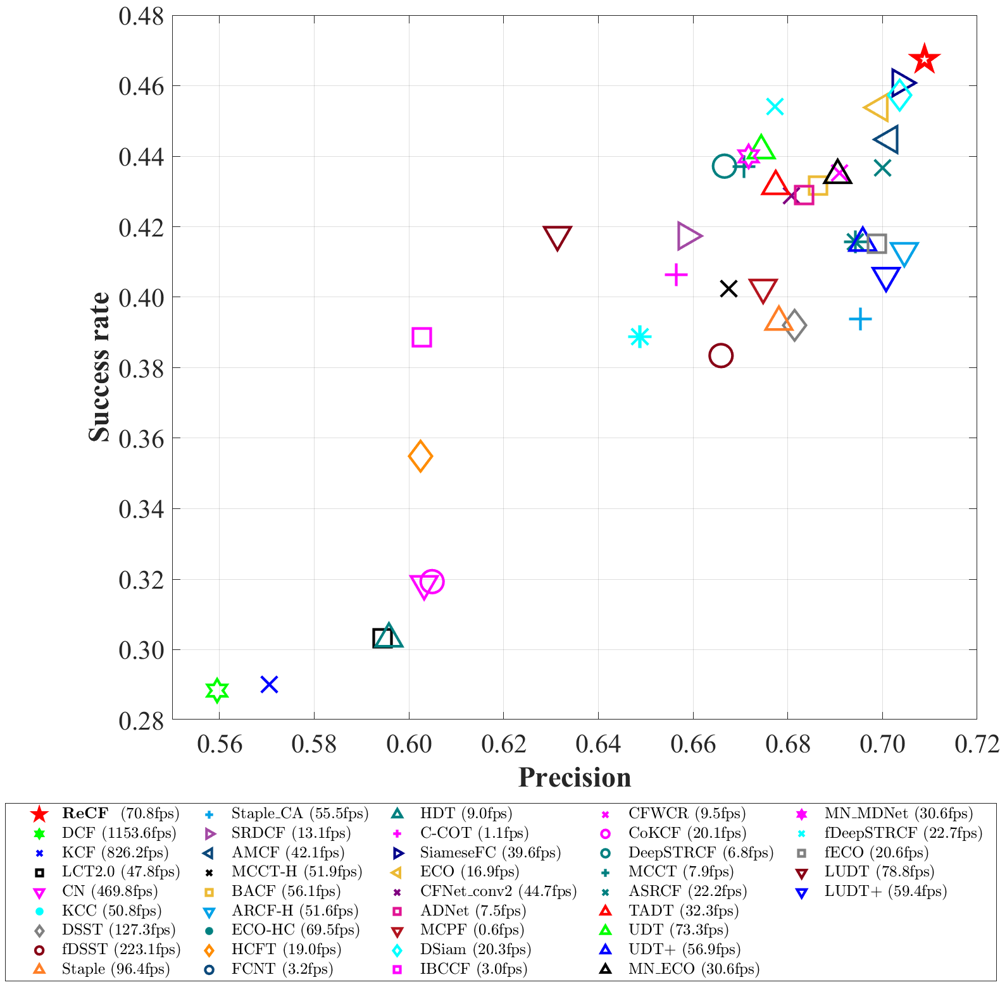
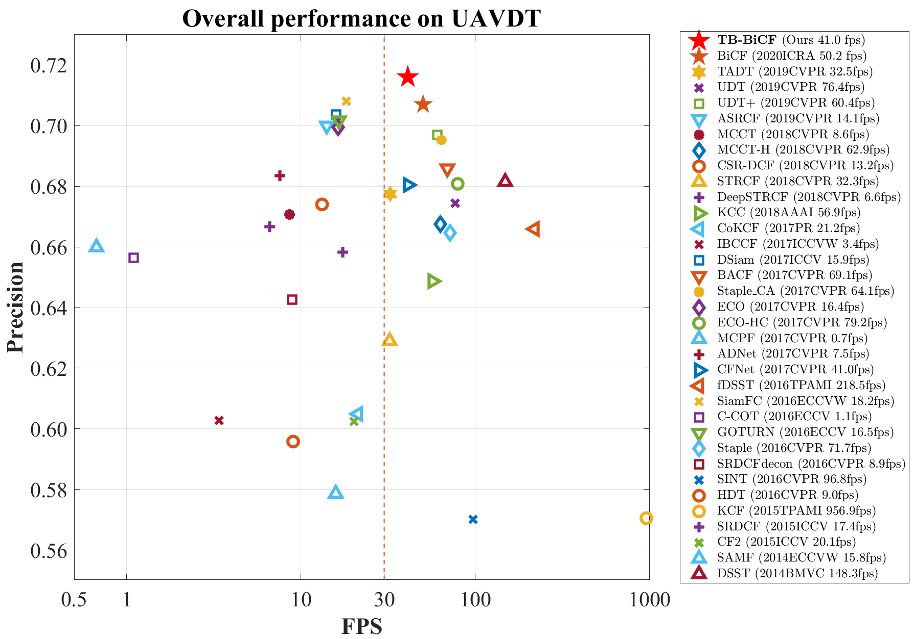
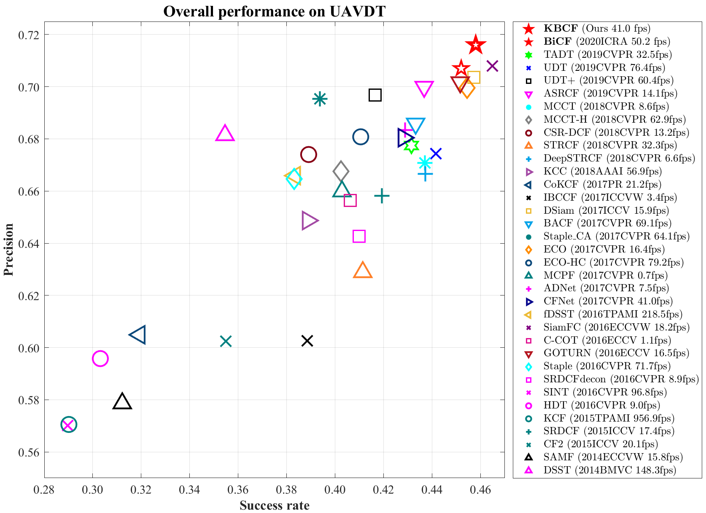

[**star_plot**](#star_plot)

- [overview](#overview)
- [deprecated](#deprecated)

# star_plot

# 星星图

:star: Update!

- more clear code
- add legend with columns

## overview

- `star_plot_v3.m`

  - star_plot_v3

    

- `TB-BiCF_prec_log_star.m` 与`TB-BiCF_succ_log_star.m`

## deprecated

- `star_plot_v2.m`

  - star_plot_v2

    

  - star_plot_v2

    