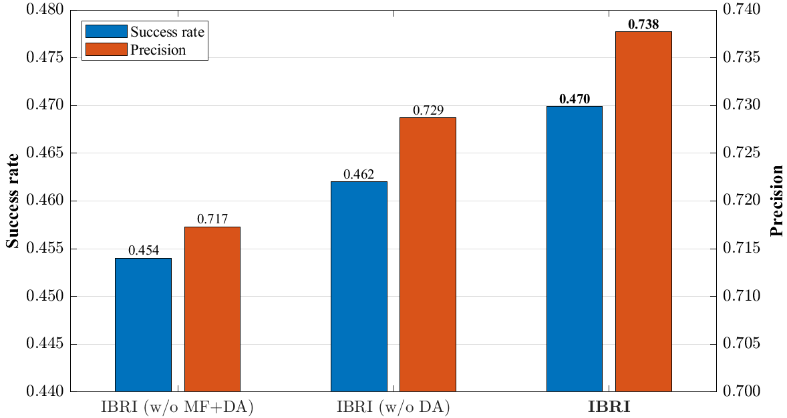

# 柱状图-多数据集(or消融实验)分析

- TODO

```
1.三根柱子配色切换
% 0.01, 0.44, 0.75
% 0.88, 0.46, 0.40
% 0.04, 0.56, 0.64
2.多柱子自动切换！
```

- `single_bar_plot.m`

  

- `double_bar_plot.m`

> 多个跟踪器在一个指标**两个**数据集的分析


- `triple_bar_plot.m`

> 多个跟踪器在一个指标（可切换）**三个**数据集的分析


- `yyaxis_bar_plot.m` 左右轴柱状图

  

