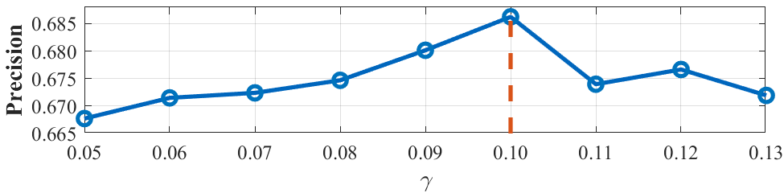
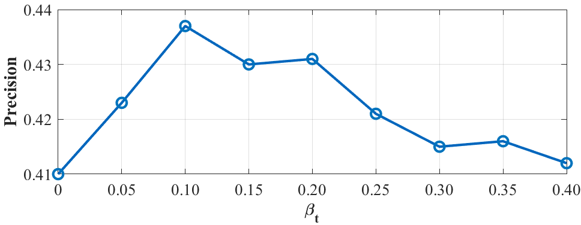
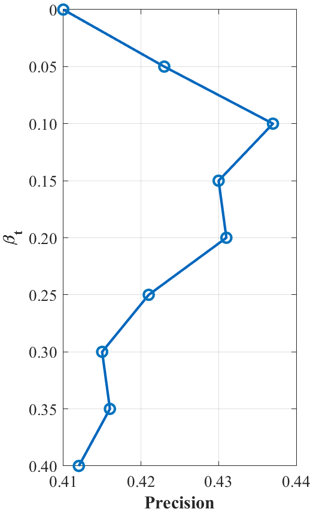

# 折线图-参数分析

- `TB-BiCF/gamma_line_chart_v2.m`与`TB-BiCF/fintl_line_chart_v2.m`（添加额外的竖直垂线！）

  | prec/succ | gamma                                                     | fintl                                                     |
  | --------- | --------------------------------------------------------- | --------------------------------------------------------- |
  | prec      |  |  |
  | succ      |  |  |

- `horizontal_line_chart.m`与`vertical_line_chart.m`

  | horizontal                                            | vertical                                          |
  | ----------------------------------------------------- | ------------------------------------------------- |
  |  |  |

  
